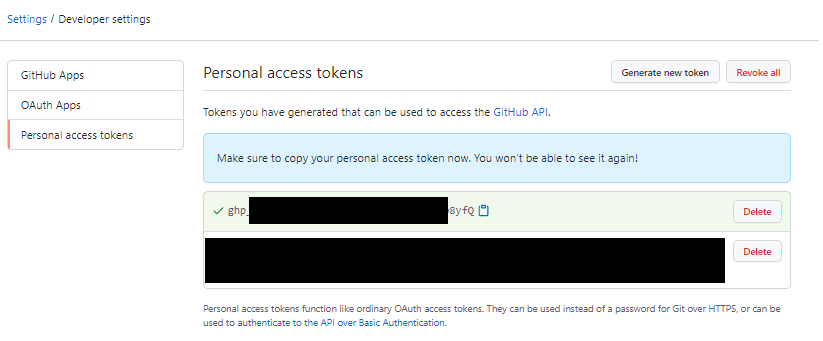

# GHCR (Github Container Registry)


The `ghcr` registry lets you configure [GHCR](https://docs.github.com/en/packages/working-with-a-github-packages-registry/working-with-the-docker-registry) integration.

### Variables

| Env var                                      | Required       | Description     | Supported values                         | Default value when missing |
| -------------------------------------------- |:--------------:| --------------- | ---------------------------------------- | -------------------------- | 
| `WUD_REGISTRY_GHCR_{REGISTRY_NAME}_USERNAME` | :white_circle: | Github username |                                          |                            |
| `WUD_REGISTRY_GHCR_{REGISTRY_NAME}_TOKEN`    | :white_circle: | Github token    | Github password or Github Personal Token |                            |

### Examples

#### Configure to access private images

<!-- tabs:start -->
#### **Docker Compose**
```yaml
services:
  whatsupdocker:
    image: getwud/wud
    ...
    environment:
      - WUD_REGISTRY_GHCR_PRIVATE_USERNAME=john@doe
      - WUD_REGISTRY_GHCR_PRIVATE_TOKEN=xxxxx 
```
#### **Docker**
```bash
docker run \
  -e WUD_REGISTRY_GHCR_PRIVATE_USERNAME="john@doe" \
  -e WUD_REGISTRY_GHCR_PRIVATE_TOKEN="xxxxx" \
  ...
  getwud/wud
```
<!-- tabs:end -->

### How to create a Github Personal Token
#### Go to your Github settings and open the Personal Access Token tab
[Click here](https://github.com/settings/tokens)

#### Click on `Generate new token`
Choose an expiration time & appropriate scopes (`read:packages` is only needed for wud) and generate.


#### Copy the token & use it as the WUD_REGISTRY_GHCR_{REGISTRY_NAME}_TOKEN value

