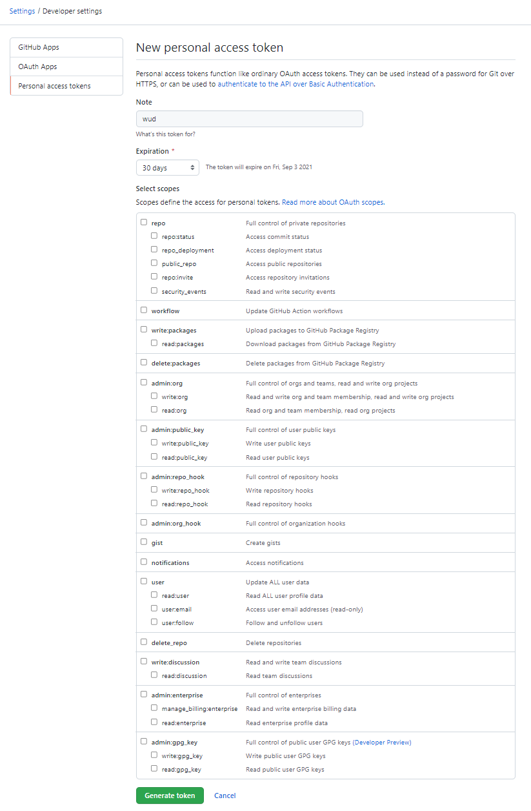

# LSCR (LinuxServer Container Registry)


The `lscr` registry lets you configure [LSCR](https://fleet.linuxserver.io/) integration.

### Variables

| Env var                      |   Required    | Description     | Supported values                         | Default value when missing |
|------------------------------|:-------------:|-----------------|------------------------------------------|----------------------------| 
| `WUD_REGISTRY_LSCR_USERNAME` | :red_circle:  | Github username |                                          |                            |
| `WUD_REGISTRY_LSCR_TOKEN`    | :red_circle:  | Github token    | Github password or Github Personal Token |                            |

### Examples

<!-- tabs:start -->
#### **Docker Compose**
```yaml
version: '3'

services:
  whatsupdocker:
    image: fmartinou/whats-up-docker
    ...
    environment:
      - WUD_REGISTRY_LSCR_USERNAME=john@doe
      - WUD_REGISTRY_GLSR_TOKEN=xxxxx 
```
#### **Docker**
```bash
docker run \
  -e WUD_REGISTRY_LSCR_USERNAME="john@doe" \
  -e WUD_REGISTRY_LSCR_TOKEN="xxxxx" \
  ...
  fmartinou/whats-up-docker
```
<!-- tabs:end -->

### How to create a Github Personal Token
#### Go to your Github settings and open the Personal Access Token tab
[Click here](https://github.com/settings/tokens)

#### Click on `Generate new token`
Choose an expiration time & appropriate scopes (`read:packages` is only needed for wud) and generate.


#### Copy the token & use it as the WUD_REGISTRY_GHCR_TOKEN value

