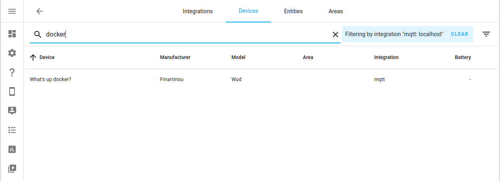
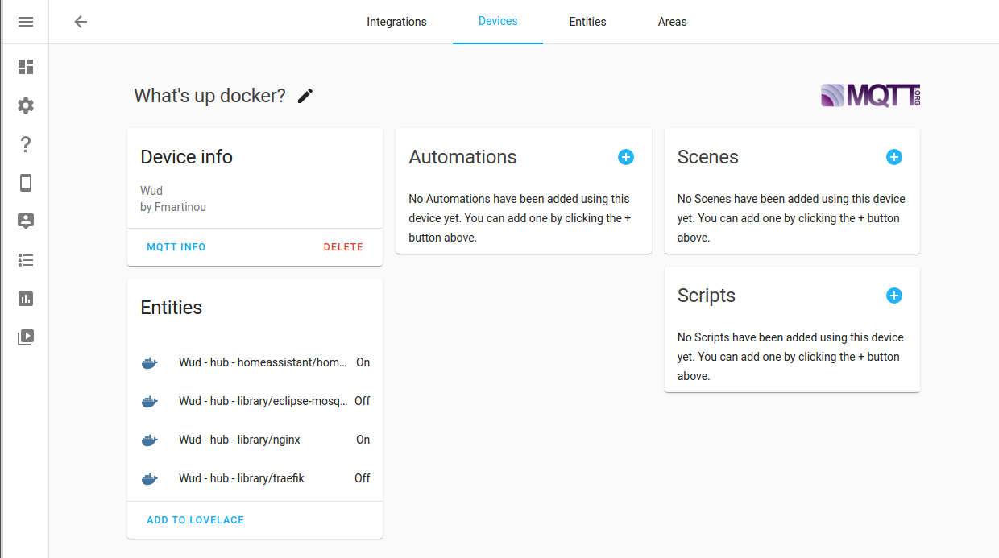
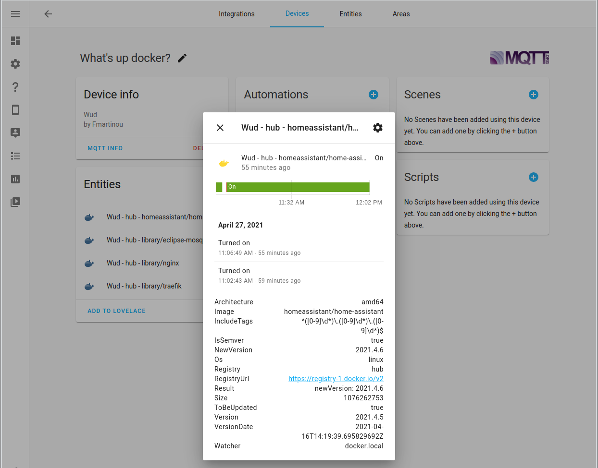

## Mqtt


The ```mqtt``` trigger lets you send image update notifications to an MQTT broker.

### Variables

| Env var                                            | Description                                                         | Supported values                    | Default value |
|:--------------------------------------------------:|:-------------------------------------------------------------------:|:-----------------------------------:|:-------------:| 
| ```WUD_TRIGGER_MQTT_{trigger_name}_URL```          | The URL of the MQTT broker                                          | Valid mqtt, mqtts, tcp, ws, wss url |               |
| ```WUD_TRIGGER_MQTT_{trigger_name}_USER```         | The username if broker authentication is enabled                    |                                     |               |
| ```WUD_TRIGGER_MQTT_{trigger_name}_PASSWORD```     | The password if broker authentication is enabled                    |                                     |               |
| ```WUD_TRIGGER_MQTT_{trigger_name}_TOPIC```        | The base topic where the updates are published to                   |                                     | wud/image     |
| ```WUD_TRIGGER_MQTT_{trigger_name}_HASS_ENABLED``` | Enable [Home-assistant](https://www.home-assistant.io/) integration | true / false                        | false         |
| ```WUD_TRIGGER_MQTT_{trigger_name}_HASS_PREFIX```  | Base topic for hass entity discovery                                |                                     | homeassistant |

### Examples

#### Post a message to a local mosquitto broker

```bash
WUD_TRIGGER_MQTT_MOSQUITTO_URL="mqtt://localhost:1883"
```

#### Post a message to a maqiatto broker

```bash
WUD_TRIGGER_MQTT_MAQIATTO_URL="tcp://maqiatto.com:1883"
WUD_TRIGGER_MQTT_MAQIATTO_USER="john@doe.com"
WUD_TRIGGER_MQTT_MAQIATTO_PASSWORD="mysecretpassword"
WUD_TRIGGER_MQTT_MAQIATTO_TOPIC="john@doe.com/wud/image"
```

#### Example of sent message
```javascript
{
  "id":"657a87c8-7926-4e97-815b-60bb9fdada2a",
  "trigger":"https://hub.docker.com",
  "image":"library/mariadb",
  "version":"10.3.13",
  "versionDate":"2019-03-12T01:01:32.052509774Z",
  "architecture":"amd64",
  "os":"linux",
  "size":368482149,
  "isSemver":true,
  "result":{
     "tag":"10.5.4-focal"
  },
  "tag":"10.5.4-focal",
  "created":"2020-08-09T17:19:42.789Z",
  "updated":"2020-08-10T11:00:01.365Z"
}
```

### Home-Assistant integration


WUD can be easily integrated into [Home-Assistant](https://www.home-assistant.io/) using [MQTT Discovery](https://www.home-assistant.io/docs/mqtt/discovery/).
 
```bash
WUD_TRIGGER_MQTT_MOSQUITTO_URL="mqtt://localhost:1883"
WUD_TRIGGER_MQTT_MOSQUITTO_HASS_ENABLED="true"
```

##### Check that mqtt integration is properly configured.


##### A WUD device is automatically added to the hass registry


##### Entities are automatically created (per Docker image)


Entities are [binary_sensors](https://www.home-assistant.io/integrations/binary_sensor/) whose state is true when an update is available.

##### Entities


Entities expose all the details of the image as attributes:
- Current version
- New version
- Registry
- Architecture
- OS
- Size
- ...
